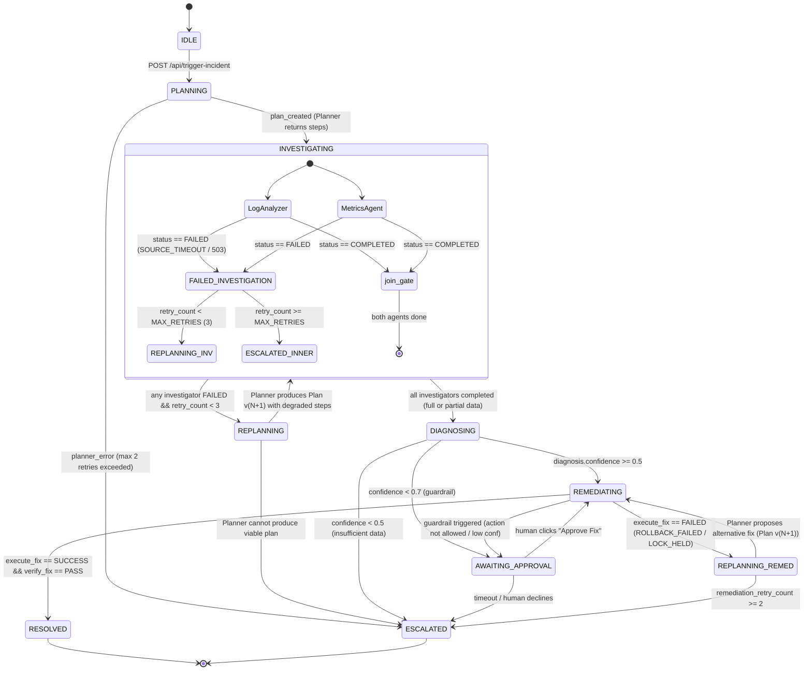

# AEGIS — Autonomous Emergency Grid for Incident Response & Self-healing

## Project Overview

**Codename**: AEGIS  
**Track**: Autonomous Orchestration with Managed Agents  
**Stack**: Antigravity Agent (`antigravity-preview-09-2026`) via Google GenAI Interactions API  
**Team Size**: 3 people × 5 hours (hackathon)  
**Repo**: https://github.com/Skullybutcher/google_deepmind (public)  
**Demo**: Hosted web app (Cloud Run backend + Firebase Hosting frontend)  

---

## The Problem We Solve

When a production system alert fires (server down, latency spike, failing health checks), a human SRE must:
1. **Triage** — read the alert, decide what logs/metrics to pull
2. **Investigate** — query multiple systems (logs, metrics, recent deploys, config changes)
3. **Diagnose** — correlate findings into a root-cause hypothesis
4. **Remediate** — apply a fix (rollback, restart, scale up)
5. **Verify** — confirm the fix worked; if not, try something else

This is a *perfect* multi-agent use case because each step is a distinct capability, the state is complex (multiple parallel data streams converge into a diagnosis), failures are common (a log source is unreachable, a rollback fails), and retry-without-thinking is dangerous.

---

## What We Build (Scoped for 5 Hours)

**AEGIS** is a live incident-response orchestration system. The user clicks **"Trigger Incident"** on a web dashboard. The system:

1. **Planner Agent** receives the alert, decomposes it into investigation subtasks
2. **Log Analyzer Agent** fetches and analyzes simulated application logs
3. **Metrics Agent** fetches and analyzes simulated infrastructure metrics (CPU, memory, latency)
4. **Diagnostician Agent** synthesizes findings from both investigators into a root-cause hypothesis
5. **Remediator Agent** executes the proposed fix in a simulated environment
6. **Orchestrator** tracks state across all agents, detects failures, and re-plans

The entire flow runs live in ~30–60 seconds (stub mode) or ~2-3 minutes (real Interactions API mode), with state transitions visible on the dashboard in real time.

---

## System Architecture

### Agent Roster (5 agents + 1 orchestrator)

```
┌─────────────────────────────────────────────────────────────────────┐
│                        AEGIS ORCHESTRATOR                          │
│  (Main process — NOT an LLM agent. Pure state machine + router.)   │
│                                                                    │
│  State Store: In-memory JSON object (persisted to file each step)  │
│  Communication: Interactions API sessions per agent                │
└──────────┬──────────┬──────────┬──────────┬──────────┬─────────────┘
           │          │          │          │          │
       ┌────▼───┐ ┌────▼───┐ ┌───▼────┐ ┌──▼───┐ ┌───▼────────┐
       │PLANNER │ │LOG     │ │METRICS │ │DIAG  │ │REMEDIATOR  │
       │AGENT   │ │ANALYZER│ │AGENT   │ │AGENT │ │AGENT       │
       └────────┘ └────────┘ └────────┘ └──────┘ └────────────┘
```

### Agent Definitions

| Agent | Role | Tools / Capabilities | Model |
|---|---|---|---|
| **Planner** | Receives raw alert, outputs ordered subtask list with dependencies | `create_plan` tool (structured output) | `antigravity-preview-09-2026` |
| **LogAnalyzer** | Fetches & parses application logs for anomalies | `fetch_logs` tool (returns simulated log data), `analyze_pattern` | `antigravity-preview-09-2026` |
| **MetricsAgent** | Fetches & interprets infrastructure metrics | `fetch_metrics` tool (returns simulated time-series), `detect_anomaly` | `antigravity-preview-09-2026` |
| **Diagnostician** | Correlates findings from investigators, proposes root cause | `correlate_findings` tool, `propose_diagnosis` | `antigravity-preview-09-2026` |
| **Remediator** | Executes proposed fix in simulated sandbox | `execute_fix` tool, `verify_fix` tool | `antigravity-preview-09-2026` |

### Orchestrator (NOT an LLM — deterministic state machine)

The Orchestrator is the backbone. It is **not** an LLM agent — it is a deterministic Python process that:
1. Manages the **Incident State Object** (see below)
2. Creates and manages **Interactions API sessions** for each agent
3. Routes data between agents based on the current plan and state
4. Detects failures (timeouts, error responses, failed verifications)
5. Triggers re-planning by calling the Planner Agent with updated context
6. Emits **Server-Sent Events (SSE)** to the frontend for live updates

> **Key design decision**: The Orchestrator is deterministic, not LLM-based, because:
> - It's faster and more reliable (no hallucination in routing logic)
> - The *agents* do the intelligent work; the orchestrator does traffic control
> - This is a legitimate and common pattern in production multi-agent systems
> - It makes failure detection and state tracking predictable and testable

### Incident State Object (the "long-horizon state")

```json
{
  "incident_id": "INC-20260926-001",
  "status": "INVESTIGATING",
  "alert": {
    "type": "HIGH_LATENCY",
    "service": "api-gateway",
    "severity": "P1",
    "timestamp": "2026-09-26T10:00:00Z"
  },
  "plan": {
    "version": 1,
    "steps": [
      {"id": "S1", "agent": "LogAnalyzer", "status": "COMPLETED", "output": "..."},
      {"id": "S2", "agent": "MetricsAgent", "status": "COMPLETED", "output": "..."},
      {"id": "S3", "agent": "Diagnostician", "status": "IN_PROGRESS", "depends_on": ["S1", "S2"]},
      {"id": "S4", "agent": "Remediator", "status": "PENDING", "depends_on": ["S3"]}
    ]
  },
  "findings": {
    "log_analysis": { "anomalies": ["..."], "confidence": 0.85 },
    "metrics_analysis": { "anomalies": ["..."], "confidence": 0.92 }
  },
  "diagnosis": null,
  "remediation": { "action": null, "result": null },
  "history": [
    {"timestamp": "...", "event": "PLAN_CREATED", "detail": "..."},
    {"timestamp": "...", "event": "AGENT_STARTED", "agent": "LogAnalyzer"},
    {"timestamp": "...", "event": "AGENT_COMPLETED", "agent": "LogAnalyzer", "output_summary": "..."},
    {"timestamp": "...", "event": "FAILURE_DETECTED", "agent": "LogAnalyzer", "error": "SOURCE_TIMEOUT"},
    {"timestamp": "...", "event": "REPLAN_TRIGGERED", "reason": "LogAnalyzer failed, switching to degraded mode"}
  ],
  "plan_version_history": []
}
```

**Persistence**: JSON file on disk, updated after every state transition. Simplest thing that demonstrably works and is visible in the demo.

### Communication Flow via Interactions API

```
User clicks "Trigger Incident"
    │
    ▼
Orchestrator creates Incident State Object
    │
    ▼
Orchestrator → Interactions API → Planner Agent session
    │  (sends: alert details)
    │  (receives: structured plan with subtask list)
    ▼
Orchestrator updates state with plan, starts parallel agent sessions:
    ├── Interactions API → LogAnalyzer session (sends: log query params)
    └── Interactions API → MetricsAgent session (sends: metric query params)
    │
    │  (both run concurrently; Orchestrator polls/awaits both)
    ▼
Orchestrator collects outputs, updates state, starts:
    └── Interactions API → Diagnostician session (sends: combined findings)
    │
    ▼
Orchestrator receives diagnosis, updates state, starts:
    └── Interactions API → Remediator session (sends: diagnosis + proposed fix)
    │
    ▼
Orchestrator receives remediation result:
    ├── SUCCESS → mark RESOLVED, emit final SSE event
    └── FAILURE → re-plan (call Planner again with failure context) or ESCALATE
```

### Tech Stack

| Layer | Technology | Rationale |
|---|---|---|
| **Agents** | Antigravity Agent via Interactions API | Required by challenge |
| **Orchestrator** | Python (FastAPI) | Best async support, team likely comfortable |
| **State** | JSON file + in-memory dict | Simplest possible; no DB setup time |
| **Frontend** | React + Vite + Tailwind CSS | Dark mode, flowchart visualization, real-time SSE |
| **Live updates** | Server-Sent Events (SSE) | Simpler than WebSockets; native browser support |
| **Hosting** | Backend: Cloud Run (GCP), Frontend: Firebase Hosting | Free tier, fast deploy, GCP-native |
| **Demo recording** | Screen capture (OBS / browser ext) | Backup if live demo flakes |

---

## Failure-Injection Design

> [!IMPORTANT]
> **Sandbox Scope**: All incident response runs in a **strictly controlled local sandbox**. No live infrastructure is queried. Every tool (`fetch_logs`, `fetch_metrics`, `execute_fix`, `verify_fix`) returns **hardcoded simulated data** from the `tools/simulated.py` module. This means:
> - The demo never flakes due to external API outages
> - Every failure is an **engineered test of recovery logic**, not a bug
> - Judges can trigger failures deterministically via dashboard buttons

The specific mock errors are:
- `PermissionError: Missing IAM Role for CloudWatch` → mapped to "Log Source Unavailable"
- `DeploymentLockError: Rollback blocked by CI/CD pipeline pid-4521` → mapped to "Remediation Failed"

These are realistic production errors that an SRE would encounter. The point is not that we can call a real API — it's that the **multi-agent system recovers intelligently when the API fails**.

### Failure 1: "Log Source Unavailable" (Investigation-Phase Failure)

- **What happens**: The `fetch_logs` tool in LogAnalyzer returns an error (simulated timeout / 503)
- **Mock error payload**:
```json
{
  "status": "error",
  "error_code": "SOURCE_TIMEOUT",
  "message": "PermissionError: Missing IAM Role for CloudWatch — Failed to connect to log aggregation service after 30s"
}
```
- **How injected**: Boolean flag `INJECT_LOG_FAILURE` set via dashboard button. The simulated `fetch_logs` tool checks this flag and returns the error payload above instead of log data.
- **Orchestrator detection**: LogAnalyzer session returns an error output or times out (30s timeout)
- **Recovery behavior**:
  1. Orchestrator marks step S1 (LogAnalyzer) as `FAILED` in state
  2. Orchestrator calls Planner Agent with updated context: "LogAnalyzer failed due to source unavailability. Replan with available data only."
  3. Planner produces Plan v2: skip log analysis, proceed with Metrics-only diagnosis (degraded mode)
  4. State object records the replan event, increments plan version
  5. Dashboard shows: ❌ LogAnalyzer failed → 🔄 Replanning → ✅ New plan created → continues

### Failure 2: "Remediation Failed" (Action-Phase Failure)

- **What happens**: The `execute_fix` tool in Remediator returns a deployment lock error
- **Mock error payload**:
```json
{
  "status": "error",
  "error_code": "ROLLBACK_FAILED",
  "message": "DeploymentLockError: Cannot rollback — deployment lock held by CI/CD pipeline process pid-4521. Manual intervention required."
}
```
- **How injected**: Boolean flag `INJECT_REMEDIATION_FAILURE` set via a second dashboard button
- **Orchestrator detection**: Remediator session returns a failure result
- **Recovery behavior**:
  1. Orchestrator marks remediation as `FAILED` in state
  2. Orchestrator calls Planner Agent: "Remediation failed. Propose alternative fix or escalate."
  3. Planner may propose: "Try service restart instead of rollback" (Plan v3)
  4. If second remediation also fails (max retries = 2), Orchestrator sets status to `ESCALATED` and emits "Requires Human Intervention."
  5. Dashboard shows the full failure chain with timestamps

### Why These Two Are Sufficient

- **Failure 1** = recovery during *investigation* (mid-pipeline)
- **Failure 2** = recovery during *action* (end-of-pipeline)
- Together they show recovery at any stage, not just one hardcoded point
- Both are **on-demand** via buttons for reliable judge demos
- Both use **realistic production error messages** judges will recognize from real SRE work

---

## Three-Person Work Breakdown

### Person A — "Orchestrator Swarm" (Backend + State + Integration Lead)

| Deliverable | Hour | Details |
|---|---|---|
| Interactions API spike | 0:00–0:30 | Validate API auth, test agent session, share findings with B |
| Orchestrator skeleton | 0:30–1:30 | FastAPI: `/api/trigger-incident`, SSE `/api/events`, in-memory state, stub agent calls |
| State management | 1:30–2:00 | Incident State Object, JSON persistence, transitions, history logging |
| Wire real agent calls | 2:00–3:00 | Replace stubs with Interactions API calls. Parallel execution for Log+Metrics |
| Failure detection + recovery | 3:00–3:30 | Timeout detection, error handling, replan trigger, failure flags |
| Integration + deploy | 3:30–4:00 | Wire frontend SSE, deploy to Cloud Run / Firebase |
| Testing + buffer | 4:00–4:30 | E2E testing: happy path + both failure scenarios |

### Person B — "Agent Swarm" (All LLM Agents + Tools + Prompts)

| Deliverable | Hour | Details |
|---|---|---|
| API spike (with A) | 0:00–0:30 | Validate Interactions API. Understand agent registration, tools, system prompts |
| Planner Agent | 0:30–1:15 | System prompt + `create_plan` tool. Structured JSON output. Test with 2–3 alerts |
| LogAnalyzer Agent | 1:15–1:45 | System prompt + `fetch_logs` (simulated data) + `analyze_pattern`. Failure hook |
| MetricsAgent | 1:45–2:15 | System prompt + `fetch_metrics` (simulated data) + `detect_anomaly` |
| Diagnostician Agent | 2:15–2:45 | System prompt + `correlate_findings` + `propose_diagnosis` |
| Remediator Agent | 2:45–3:15 | System prompt + `execute_fix` + `verify_fix`. Failure hook |
| Prompt tuning | 3:15–3:45 | Test all agents through Orchestrator. Tune for consistent structured output |
| Writeup drafting | 3:45–4:30 | Draft the Kaggle writeup (technical sections) |

### Person C — "Frontend Swarm" (Dashboard + Visual Design + Demo)

| Deliverable | Hour | Details |
|---|---|---|
| React scaffold + Tailwind | 0:00–0:45 | Vite + React + Tailwind, dark mode, glassmorphism cards |
| Agent status panel | 0:45–1:30 | Central card: incident status, plan steps, live status chips. Mock data first |
| Flowchart visualization | 1:30–2:30 | Animated flow diagram showing agent pipeline with real-time status |
| CTA buttons + failure UI | 2:00–2:30 | Primary "Trigger Incident" pill. Secondary failure inject buttons |
| SSE integration | 2:30–3:00 | Connect to `/api/events`. Parse events, update UI live. Animate transitions |
| Incident timeline | 3:00–3:30 | Scrollable timeline below main card with color-coded event history |
| Integration + polish | 3:30–4:00 | Final integration, responsive check, visual bug fixes |
| Demo recording | 4:00–4:30 | Record 2-min demo. Ensure hosted version stable |

---

## Key Technical Decisions

### 1. Deterministic Orchestrator vs LLM Orchestrator
We explicitly chose a **deterministic Python state machine** over an LLM-based orchestrator. This is a defining architectural choice that demonstrates production thinking:
- Routing logic cannot hallucinate
- State transitions are testable and auditable
- Failure detection is reliable (not "did the LLM notice?")
- The agents do the reasoning; the orchestrator does the plumbing

### 2. Native Interactions API State Management
We use `previous_interaction_id` and `environment_id` to chain agent context natively through the Interactions API — **not** by concatenating massive prompt histories. This is a key differentiator:

```python
# First interaction: Planner creates initial plan
response_v1 = await interactions_api.create_interaction(
    agent_id="planner-agent",
    model="antigravity-preview-09-2026",
    messages=[{"role": "user", "content": f"ALERT: {alert.to_json()}\nCreate an investigation plan."}],
    tools=[create_plan_tool_def],
)

# Later, LogAnalyzer fails...
# Second interaction: Planner re-plans WITH full prior context
response_v2 = await interactions_api.create_interaction(
    agent_id="planner-agent",
    model="antigravity-preview-09-2026",
    messages=[{"role": "user", "content": f"FAILURE: LogAnalyzer failed (SOURCE_TIMEOUT). Replan using available data only."}],
    tools=[create_plan_tool_def],
    previous_interaction_id=response_v1.interaction_id,  # ← NATIVE STATE CHAIN
)
```

### 3. Structured Output via Tool Calling (Not Free Text)
All agent interactions use **tool calling / function calling** with strict JSON schemas — never free-text responses. The orchestrator wraps every agent response in `safe_parse()` with one retry and deterministic fallbacks.

### 4. Hard Limits (No Infinite Loops)
```python
MAX_PLAN_VERSIONS = 3          # Planner can replan at most 3 times per incident
MAX_AGENT_RETRIES = 2          # Each agent gets at most 2 retry attempts on failure
MAX_REMEDIATION_ATTEMPTS = 2   # Remediator gets at most 2 fix attempts
AGENT_TIMEOUT_SECONDS = 120    # Real API calls need 90-120s (sandbox provisioning)
MAX_INCIDENT_DURATION = 240    # Entire incident auto-escalates after 4 minutes
```

### 5. Remediator Guardrails (Policy-as-Code)
```python
ALLOWED_ACTIONS = frozenset({"ROLLBACK", "RESTART", "SCALE_UP"})
FORBIDDEN_ACTIONS = frozenset({"DELETE", "DROP", "TERMINATE", "PURGE"})

def guard(action_type: str, confidence: float, requires_approval_below: float = 0.7):
    if action_type in FORBIDDEN_ACTIONS:
        return {"allowed": False, "reason": "forbidden action"}
    if action_type not in ALLOWED_ACTIONS:
        return {"allowed": False, "reason": "not in allow-list"}
    if confidence < requires_approval_below:
        return {"allowed": True, "requires_approval": True}
    return {"allowed": True, "requires_approval": False}
```
Plus a human-approval UI button that emits an `APPROVED` SSE event — every decision logged in `state.history`.

---

## Golden-Scenario Evaluation Harness

8 scenarios, 82 checks — **all passing**:

| Fixture | Description | Key Assertions |
|---|---|---|
| `sc01` Happy path — high latency | Memory leak, rollback resolves | RESOLVED, conf≥0.85, plan v1 |
| `sc02` Happy path — OOM crash | OOM + memory leak, rollback | RESOLVED, conf≥0.85, plan v1 |
| `sc03` Log source unavailable | Degraded mode, metrics-only diag | RESOLVED, conf 0.65-0.75, plan v2, REPLAN_TRIGGERED |
| `sc04` Remediation fails | Escalates after 2 attempts | ESCALATED, attempts=2 |
| `sc05` Both failures | Full failure chain | ESCALATED, plan v2, full history |
| `sc06` P3 minor alert | Fast path resolves | RESOLVED, conf≥0.7 |
| `sc07` Guardrail — disallowed action | DELETE blocked | AWAITING_APPROVAL, guardrail_triggered |
| `sc08` Guardrail — low confidence | Conf 0.45 requires approval | AWAITING_APPROVAL, confidence_below_threshold |

Run: `python -m backend.eval.run_eval` → **82/82 PASS**

---

## Dashboard & UX

- **Dark mode** with Tailwind CSS + custom "LightRays" WebGL background (ogl)
- **Flowchart visualization**: Animated agent pipeline showing real-time status (PENDING → IN_PROGRESS → COMPLETED / FAILED)
- **Live status chips**: Each agent has a status indicator that updates via SSE
- **Incident timeline**: Scrollable, color-coded event history (created, started, completed, failed, replanned, resolved, escalated)
- **Failure injection buttons**: "Inject Log Failure", "Inject Remediation Failure" — one-click demo triggers
- **Telemetry panel**: Live cost/latency/token tracking per incident
- **Replay capability**: `/api/replay/{incident_id}` replays SSE stream at 10x

---

## API Contracts

### REST Endpoints

| Method | Path | Description |
|---|---|---|
| POST | `/api/trigger-incident` | Start new incident `{alert_type, service, severity}` |
| POST | `/api/inject-failure` | Inject failure `{failure_type: LOG_SOURCE_UNAVAILABLE|REMEDIATION_FAILED|NONE}` |
| GET | `/api/events` | SSE stream: `event: state_update` + JSON data |
| GET | `/api/state` | Full incident state object (polling fallback) |
| GET | `/api/health` | Health check |
| GET | `/api/replay/{incident_id}` | SSE replay of historical incident |

### SSE Event Format
```
event: state_update
data: {"event_type":"AGENT_STARTED","timestamp":"...","incident_id":"...","data":{"status":"INVESTIGATING","active_agent":"LogAnalyzer","plan_version":1,"steps":[...],"history":[...],"message":"LogAnalyzer is scanning..."}}
```

### Agent I/O Contracts (Orchestrator ↔ Agents)

**Planner** → `create_plan` tool: `{steps: [{id, agent, description, depends_on}], reasoning}`

**LogAnalyzer** → `fetch_logs` + `analyze_pattern` → `report_log_findings` tool: `{anomalies[], likely_trigger, confidence}`

**MetricsAgent** → `fetch_metrics` + `detect_anomaly` → `report_metrics` tool: `{anomalies[], inflection_point, confidence}`

**Diagnostician** → `correlate_findings` + `propose_diagnosis` → `report_diagnosis` tool: `{root_cause, confidence, evidence[], recommended_action, action_details}`

**Remediator** → `execute_fix` + `verify_fix` → `report_remediation` tool: `{status, action, result}`

---

## State Machine Transitions (Mermaid)



---

## Repository Structure

```
aegis/
├── backend/
│   ├── main.py                 # FastAPI app, routes, SSE endpoint
│   ├── orchestrator.py         # State machine, agent routing, failure detection
│   ├── state.py                # Incident state model, persistence, history
│   ├── guardrails.py           # Remediator policy-as-code (allow-list, confidence gates)
│   ├── agents/
│   │   ├── __init__.py
│   │   ├── interface.py        # AgentBackend protocol, data classes
│   │   ├── base.py             # Real Interactions API backend implementation
│   │   ├── planner.py          # Planner agent system prompt
│   │   ├── log_analyzer.py     # LogAnalyzer agent system prompt
│   │   ├── metrics_agent.py    # MetricsAgent system prompt
│   │   ├── diagnostician.py    # Diagnostician agent system prompt
│   │   └── remediator.py       # Remediator agent system prompt
│   ├── tools/
│   │   ├── __init__.py
│   │   └── simulated.py        # All simulated tool implementations
│   ├── eval/
│   │   ├── fixtures/           # 8 JSON test scenarios
│   │   └── run_eval.py         # Golden-scenario runner (82 checks)
│   ├── requirements.txt
│   ├── Procfile                # For Render deployment
│   └── .python-version
├── frontend/
│   ├── src/
│   │   ├── App.jsx             # Main dashboard component
│   │   ├── components/
│   │   │   ├── LightRays.jsx   # WebGL background (ogl)
│   │   │   ├── Flowchart.jsx   # Agent pipeline visualization
│   │   │   ├── StatusChips.jsx # Agent status indicators
│   │   │   ├── Timeline.jsx    # Incident event history
│   │   │   └── TelemetryPanel.jsx # Cost/latency/tokens
│   │   ├── hooks/
│   │   │   └── useSSE.js       # SSE connection + reconnection
│   │   └── index.css
│   ├── package.json
│   ├── vite.config.js
│   ├── tailwind.config.js
│   └── netlify.toml            # Netlify config (alternative to Firebase)
├── for-submission/
│   └── writeup.md              # Kaggle writeup (≤1500 words)
├── doc/
│   ├── ARCHITECTURE.md
│   ├── PROJECT_PLAN.md
│   ├── TIMELINE.md
│   ├── RISKS.md
│   └── WRITEUP_OUTLINE.md
├── README.md
├── .gitignore
└── AGENTS_SYNC.md              # Local-only AI collaboration sync (not committed)
```

---

## Environment Variables

```env
GEMINI_API_KEY=your-gemini-api-key          # Also serves as Antigravity key
AEGIS_MODEL_TIER=default                    # default|fast|tired for model tiering
PORT=8000
CORS_ORIGINS=https://your-frontend.firebaseapp.com
```

---

## Deployment

### Backend (Cloud Run)
```bash
gcloud run deploy aegis-backend \
  --source backend/ \
  --region us-central1 \
  --allow-unauthenticated \
  --set-env-vars GEMINI_API_KEY=...,AEGIS_MODEL_TIER=default
```

### Frontend (Firebase Hosting)
```bash
cd frontend && npm run build
firebase deploy --only hosting
```

### Alternative: Render + Netlify
- Backend: Render Blueprint (`render.yaml`) with `backend/Procfile`
- Frontend: Netlify with `frontend/netlify.toml` (proxies `/api/*` to backend)

---

## Demo Script (2 Minutes)

1. **0:00** — Dashboard loads. Shows "All Systems Normal."
2. **0:10** — User clicks **"Trigger Incident: High Latency on API Gateway."**
3. **0:15** — Planner Agent activates, posts plan: "Investigate logs, check metrics, correlate findings, remediate."
4. **0:20** — Log Analyzer and Metrics Agent run in parallel. Live status chips update.
5. **0:30** — Diagnostician synthesizes: "Root cause: memory leak from deploy v2.3.1."
6. **0:35** — Remediator proposes: "Rollback to v2.3.0." Executes in sandbox.
7. **0:40** — Verification passes. Incident marked **RESOLVED**. Full timeline visible.
8. **0:45** — User clicks **"Inject Failure: Log Source Unavailable"**
9. **0:50** — Log Analyzer fails. Orchestrator detects, updates state to "DEGRADED_INVESTIGATION."
10. **0:55** — Orchestrator re-plans: "Skip detailed logs, use Metrics Agent + heuristic diagnosis."
11. **1:05** — Diagnostician runs with partial data, proposes best-effort fix.
12. **1:10** — Remediation attempt fails (injected). Orchestrator escalates: "REQUIRES_HUMAN — insufficient data for automated fix."
13. **1:15** — Dashboard shows full incident timeline with both failures, recovery attempts, and escalation. Demo complete.

---

## Differentiating Factors (Why Judges Pick AEGIS)

| Capability | AEGIS | Typical Single-Prompt Wrapper |
|---|---|---|
| Recovers from data-source outage | ✅ Re-plans with degraded data | ❌ Hallucinates or crashes |
| Recovers from failed remediation | ✅ Tries alternative, then escalates | ❌ Retries same action |
| Human-in-the-loop gate | ✅ Code-enforced, audited (allow-list + approval button) | ❌ "High confidence = auto" |
| Full incident audit trail | ✅ JSON + SSE replay + time-travel | ❌ Only final answer |
| Cost visible per run | ✅ Live token/$ panel | ❌ Never shown |
| Structured output | ✅ Tool calling with schemas + validation | ❌ Free text parsing |
| Native API state chaining | ✅ `previous_interaction_id` + `environment_id` | ❌ Prompt concatenation |
| Deterministic orchestration | ✅ Python state machine | ❌ LLM router |
| Regression suite | ✅ 8 scenarios, 82 checks, CI badge | ❌ "Trust the demo" |
| Production guardrails | ✅ Policy-as-code, forbidden actions | ❌ Probability thresholds only |

---

## Key Files for Deep Dive

- **Orchestrator**: `backend/orchestrator.py` — state machine, failure handling, SSE emission
- **Real API Backend**: `backend/agents/base.py` — Interactions API integration, tool loop, chaining
- **Guardrails**: `backend/guardrails.py` — policy-as-code for remediation safety
- **Eval Harness**: `backend/eval/run_eval.py` + `backend/eval/fixtures/*.json` — 82 checks
- **State Model**: `backend/state.py` — Incident State Object, persistence, history
- **Frontend**: `frontend/src/App.jsx` — dashboard, SSE hook, flowchart, telemetry panel
- **Simulated Tools**: `backend/tools/simulated.py` — deterministic sandbox data
- **Writeup**: `for-submission/writeup.md` — Kaggle submission (≤1500 words)

---

## Known Gotchas & Lessons Learned

1. **Interactions API tool locking**: Chained sessions (`previous_interaction_id`) lock the tool set from the FIRST interaction. Register every tool an agent might need at its first contact. Fallback: `fresh_session=True` to skip chaining.

2. **Sandbox latency**: Fresh sandbox calls take 11-17s; chained calls 6-8s. Use 120s timeouts, not 30s.

3. **Stale GOOGLE_API_KEY**: This machine has an invalid `GOOGLE_API_KEY` env var. Must explicitly pass `api_key` to `genai.Client()` and unset the env var.

4. **Agent tool obedience is non-deterministic**: Failure injection is enforced in `RealBackend._exec` post-hoc, so the demo CANNOT flake on the failure path — this is a feature (hybrid determinism).

5. **SSE frames need `event: state_update`**: `sse-starlette` expects this format; raw dicts cause 500s.

6. **Inject-failure flags persist across incidents** until explicitly cleared with `NONE` — fixed to not be wiped by `new_incident()`.

---

## Quick Links

- **Repo**: https://github.com/Skullybutcher/google_deepmind
- **Backend API**: https://aegis-backend-xxx.run.app (Cloud Run)
- **Frontend**: https://aegis-frontend.web.app (Firebase)
- **Eval Runner**: `python -m backend.eval.run_eval`
- **Local Dev**: 
  - Backend: `cd backend && python -m uvicorn main:app --port 8000`
  - Frontend: `cd frontend && npm run dev` (proxies to :8000)
- **Real Mode**: `USE_REAL=1 python -m uvicorn backend.main:app --port 8000`

---

## Contact / Credits

Built for the **Antigravity Agent Hackathon** (Autonomous Orchestration track) by a 3-person team in 5 hours.

**Architecture & Orchestration**: Person A (backend lead)  
**Agents & Prompts**: Person B (agent swarm)  
**Frontend & Demo**: Person C (dashboard + visualization)  

AI Collaboration: Muse Spark + FreeBuff (local AGENTS_SYNC.md coordination)

---

*This document consolidates all AEGIS project details for NotebookLM ingestion. Every technical claim is backed by runnable code in the repository.*